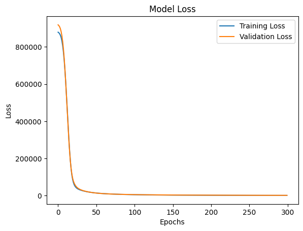
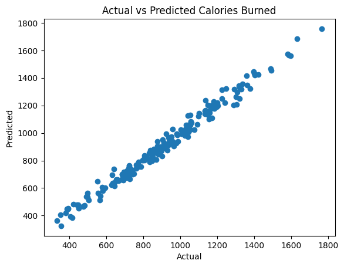

# 머신러닝 기말 프로젝트: 칼로리 예측

## 프로젝트 개요
이 프로젝트는 다양한 운동 관련 데이터를 기반으로 소모된 칼로리를 예측하는 것을 목표로 합니다. 입력 특징과 목표 칼로리 값 간의 관계를 학습하기 위해 신경망을 구현하였으며, 효율적이고 정확한 예측을 제공합니다.

---

## 프로젝트 주요 특징

### 1. **데이터 처리**
- 사용된 데이터셋: [Gym Members Exercise Dataset](https://www.kaggle.com/datasets/valakhorasani/gym-members-exercise-dataset)
  - 데이터셋은 운동 세션 정보(운동 시간, 심박수 등)와 개인 신체 정보(체중, 키, BMI 등)를 포함.
- 데이터 정리, 전처리 및 정규화를 수행하여 머신러닝에 적합한 상태로 준비.
- `StandardScaler`를 사용하여 모든 입력 변수를 동일한 스케일로 조정.

### 2. **모델 구현**
- `TensorFlow`와 `Keras`를 활용하여 신경망을 개발.
- 모델 구조:
  - **입력층**: 체중, 키, BMI, 평균 심박수 등과 같은 변수 포함.
  - **은닉층**: 64와 32 노드로 구성된 두 개의 은닉층, 활성화 함수로 ReLU 사용.
  - **출력층**: 선형 활성화 함수를 사용하여 회귀 문제 해결.

### 3. **학습 및 평가**
- 데이터를 학습용과 테스트용으로 80:20 비율로 분할.
- Adam 최적화를 사용하여 평균 제곱 오차(MSE)를 손실 함수로 설정.
- 모델 성능을 다음 지표로 평가:
  - 평균 절대 오차(MAE)
  - 평균 제곱 오차(MSE)
  - 결정 계수(R² Score)

---

## 결과

### 모델 성능
- **테스트 손실 (MSE):** 1327.06  
- **테스트 MAE:** 28.27

### 시각화 결과
1. **학습 손실 vs 검증 손실**
   - 300 에포크 동안 손실 값의 수렴을 관찰.
   - 검증 손실과 학습 손실이 유사하게 감소, 과적합 없음.

   

2. **실제 값 vs 예측 값**
   - 실제 값과 예측 값 간의 높은 상관관계를 확인, 모델의 높은 정확도를 시각적으로 확인 가능.

   

---

## 사용된 기술
- **Python 라이브러리**:
  - `numpy`: 수치 연산
  - `pandas`: 데이터 처리 및 조작
  - `matplotlib`: 데이터 시각화
  - `scikit-learn`: 데이터 전처리 및 평가
  - `tensorflow.keras`: 신경망 구현 및 학습

---

## 주요 성과
- 본 프로젝트는 운동 및 개인 데이터를 기반으로 칼로리 소모량을 성공적으로 예측.
- 사용된 데이터셋([Gym Members Exercise Dataset](https://www.kaggle.com/datasets/valakhorasani/gym-members-exercise-dataset))의 다양한 변수를 통해 정확한 결과를 도출.
- 향후 개선 사항:
  - 데이터 다양성 확대.
  - 다른 머신러닝 모델과의 성능 비교.
  - 하이퍼파라미터 최적화를 통한 정확도 향상.
